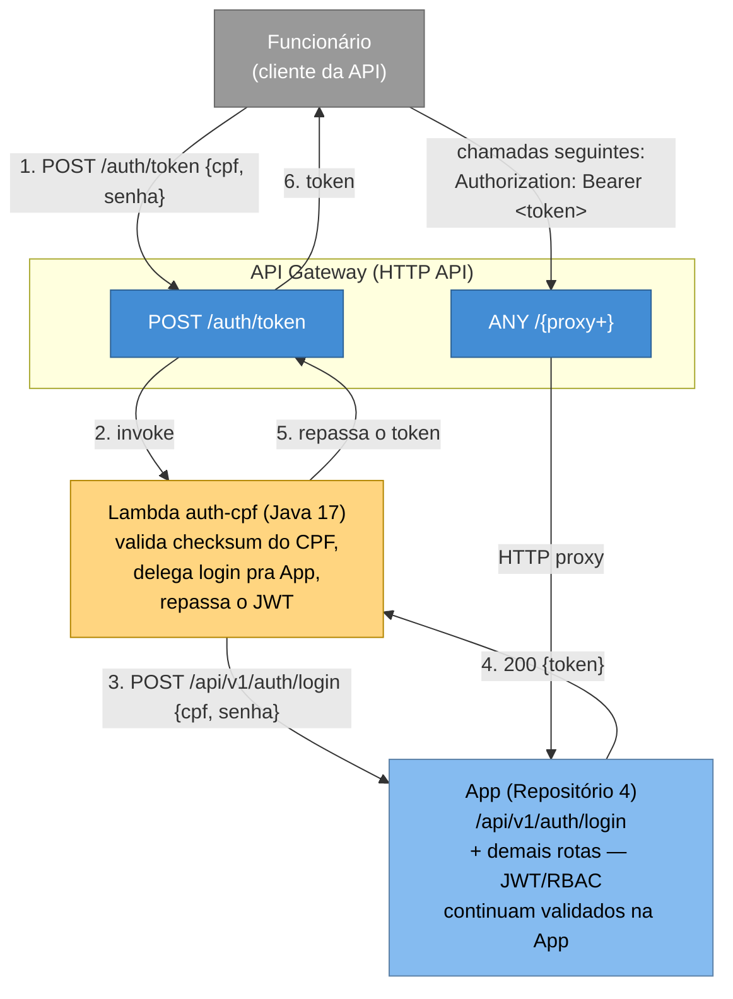

# fiap-tech-challenge-API-gateway-function-serverless

Porta de entrada única (API Gateway) e autenticação via CPF (Function Serverless) do Tech Challenge Fase 3 — FIAP Pós-Tech, Arquitetura de Software, turma 15SOAT. Repositório 1 dos 4 exigidos pela Fase 3.

## Tecnologias

| Camada | Tecnologia |
|---|---|
| Function Serverless | Java 17, Maven, `aws-lambda-java-core`/`events`, Jackson |
| Porta de entrada | Amazon API Gateway (HTTP API) |
| Provisionamento | Terraform >= 1.5, provider `hashicorp/aws` |
| Nuvem | AWS (conta acadêmica AWS Academy Learner Lab) |
| CI/CD | GitHub Actions |

## Arquitetura



**Decisões de desenho** (ADRs/RFCs completos centralizados no repositório da App, pasta [`docs/`](https://github.com/Adriana-Meyer/fiap-tech-challenge-pos-tech/tree/main/docs)):
- **Java em vez de Node.js**: a Lambda é deliberadamente fina (valida CPF, faz uma chamada HTTP, repassa a resposta) — sem framework (nada de Spring), pra não pagar cold start de um contexto de aplicação numa função tão simples. A escolha de Java (em vez de uma opção "mais simples" de runtime leve como Node/Python) foi por consistência com o resto do projeto e também como oportunidade de aprendizado da linguagem Java.
- **Lambda consulta a própria App, não é um Lambda Authorizer**: a Lambda só participa da emissão do token (rota `/auth/token`); todas as outras rotas passam direto (HTTP proxy) pra App, que continua validando o JWT e os papéis (RBAC) exatamente como antes. Evita duplicar lógica de segurança fora da App.
- **Validação de CPF duplicada, não compartilhada via lib**: o algoritmo de checksum existe tanto aqui (`lambda/auth/.../CpfValidator.java`) quanto na App (`domain/model/shared/CpfValidator.java`) — decisão consciente de não criar uma biblioteca compartilhada entre repositórios, para manter os 4 repositórios genuinamente independentes (sem acoplar o build de um ao artefato publicado por outro).
- **`app_backend_host` como variável manual**: o Terraform deste repositório não descobre o LoadBalancer da App via `data source` automático — copia-se manualmente o host (`kubectl get svc workshop-app -n workshop`, Repositório 4) pra uma variável, mesmo padrão já usado para o endpoint do RDS entre os Repositórios 3 e 4.

## Pré-requisitos

- Java 17+ e Maven (para buildar a Lambda)
- Terraform >= 1.5
- Conta AWS Academy Learner Lab **ativa** (sessão de 4h) com credenciais temporárias exportadas
- App (Repositório 4) já com deploy real feito (`deploy-aws.yml`) e o host do LoadBalancer em mãos

## Executando

```bash
# 1. Testar e empacotar a Lambda
cd lambda/auth
mvn test
mvn package
cd ../..

# 2. Provisionar Lambda + API Gateway
export AWS_ACCESS_KEY_ID=...
export AWS_SECRET_ACCESS_KEY=...
export AWS_SESSION_TOKEN=...
export TF_VAR_app_backend_host="<host-do-loadbalancer-da-app>"

terraform init
terraform plan
terraform apply

# 3. Testar o fluxo de autenticação por CPF
curl -X POST "$(terraform output -raw auth_token_endpoint)" \
  -H "Content-Type: application/json" \
  -d '{"cpf": "11144477735", "password": "workshop123"}'
```

Para desativar tudo ao final da sessão de estudo (economiza orçamento do Lab):

```bash
terraform destroy
```

## CI/CD

- **`terraform-validate.yml`** — roda em todo push/PR para `develop`/`main`: builda e testa a Lambda (`mvn package`), depois `terraform fmt -check`, `terraform init -backend=false`, `terraform validate`. Não precisa de credenciais AWS.
- **`terraform-apply.yml`** — disparo manual (`workflow_dispatch`), com escolha entre `plan`/`apply`/`destroy`. Builda a Lambda, depois roda o Terraform contra a AWS de verdade, usando credenciais temporárias da sessão AWS Academy via GitHub Secrets (`AWS_ACCESS_KEY_ID`, `AWS_SECRET_ACCESS_KEY`, `AWS_SESSION_TOKEN`, `APP_BACKEND_HOST`) — precisam ser atualizadas a cada nova sessão do Lab. Fica `workflow_dispatch` manual permanentemente, inclusive no estado final entregue: essa é a alternativa adotada para economizar os recursos limitados do Lab (sessão de ~4h) — o deploy em si é automático de ponta a ponta assim que disparado, sem nenhuma intervenção manual durante a execução; só o gatilho é manual, para ser acionado quando for conveniente e a sessão do Lab estiver ativa.

## Variáveis Terraform

| Variável | Descrição |
|---|---|
| `app_backend_host` | **Obrigatória**, sem default. Host:porta do LoadBalancer da App (Repositório 4) |
| `aws_region` | Default `us-east-1` |
| `project_name` | Default `tech-challenge` |

## APIs

- Rota de autenticação: `POST /auth/token` — ver exemplo de `curl` acima.
- Todas as demais rotas da API são as mesmas documentadas no Swagger da App: [Repositório 4](https://github.com/Adriana-Meyer/fiap-tech-challenge-pos-tech#documenta%C3%A7%C3%A3o-da-api-swagger-ui), só que acessadas através da URL deste API Gateway em vez de diretamente no LoadBalancer.
